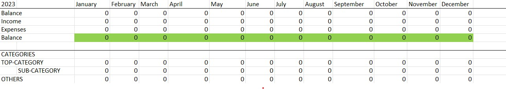

# bank-account-statement-parser
A simple program to transfer your bank statements into an excel file. The programme can recognise and assign simple keywords in the transactions and offers a simple GUI to select the pdfs and excel file. 


# Install
### Directory Structure
Not much needs to be taken care of, only that if a default path for the Excel is chosen (see Using), a configuration folder and file will be created in the same folder as the program. To use the config the program needs to be in the same folder, something like this:
```bash
bank-account-statement-parser
├───config_parser
│   └───config.json
├───Bank-Account-Statement-Parser-1.0.0.exe
```
This is also valid if you are using the plain python files.

### Using the exe
If you are usiong the exe you should be ready to go without any installations except python itself.

### If you are not using the exe
Frist you need to install some packages to run the python file. For that we provide a requirements.txt. We assume you have allready installed python and pip.
```bash
pip install -r requirements.txt
```
After the successful installation yqu are ready to go. To execute the program just double click on the GUI_pathfinder.py or use the command line with the command:
```bash
python GUI_pathfinder.py
```


# Usage
Firstly you have to open the file "Budget-Book-Template.xlsx". You will the template for your personal Excel file.

- Balance, Income, Expanses and Balance will be filled automaticly
- The cell called "CATEGORIES" will stay the same. It just tells you that now the list of different categories will start underneath
- The mainstep you have to accomplish is to edit your "TOP CATEGORY" and the corresponding "SUB-CATEGORY" it is essential to know that you are able to add as many TOP CATEGORIES as you wish and furthermore you can add to every TOP CATEGORIE as many SUB-CATEGORIES.
- The SUB-CATEGORIES can either be written in caps or lower cases, it doesn#t matter but you will have to use the same pattern aus shown in the picture above. Which means the sub-bcategories have to be indented j
- ***Important***: The sub-categories will also be ***the kewords the parser uses*** to find categories in your bank statements so make sure they suit your reason for transfer! The more sub categories you choose, the more kewords you will generate. As a result the overview will be more accurate.

When you are done with the adjustment of the Excel-file you can start the "bank-account-statement-parser-1.0.0.exe" by double cklicking it.
-The Window "Path-Configurator" will pop up you will have to choose two paths.

-The first path has to lead to the 