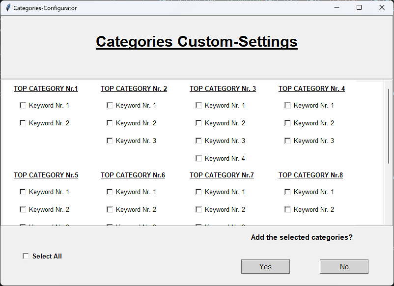

# bank-account-statement-parser
A simple program to transfer your bank statements into an excel file. The program can recognize and assign simple keywords in the transactions and offers a simple GUI to select the pdfs and excel file. 


# Install
### Directory Structure
Not much needs to be taken care of, only that if a default path for the Excel is chosen (see Usage), a configuration folder and file will be created in the same folder as the program. To use the config the program needs to be in the same folder, something like this:
```bash
bank-account-statement-parser
├───config_parser
│   └───config.json
├───Bank-Account-Statement-Parser-1.0.0.exe
```
This is also valid if you are using the plain python files.

### Using the exe
If you are using the exe you should be ready to go without any installations except python itself.

### If you are not using the exe
First you need to install some packages to run the python file. For that we provide a requirements.txt. We assume you have already installed python and pip.
```bash
pip install -r requirements.txt
```
After the successful installation you are ready to go. To execute the program just double click on the GUI_pathfinder.py or use the command line with the command:
```bash
python GUI_pathfinder.py
```


# Usage
- The Window "Path-Configurator" will pop up and you will have to choose two paths.


- The first path has to lead to the Excel-file which is called "Budget-Book-Template.xlsx".
    - If you would like to set this file to default you can do so by ticking the checkbox below. This is helpful since you will likely use one excel file for a whole year.
- The second path has to lead to your bank-account-statement pdf which you should collect in one folder for each year.
    - If you would like to upload a whole bunch of pdf's together, simply tick the checkbox below and choose for example the whole 2023 folder with all your pdf's of 2023
- Make sure you collect all your bank account statements for one year in one folder this makes it easy for you to feed the program with all of them together.
- When you are done press the Transfer-Button on the bottom-right corner and the parsing process will start.
- As soon as the process is finished you will see a message that everything has been transferred successfully.

- If the parser finds new Categories the window "Categories-Configurator" will pop up and you will have different options



- Option 1: You tick the checkbutton "Select All" and press the Button "Yes". This will take all new categories and keywords as sub categories and add them to the excel.
- Option 2: You tick only some checkbuttons and press "Yes". This will take all ticked new categories and keywords as sub categories and add them to the excel.
- Option 3: You press "No". This will close the window and nothing will be added to the excel.
- Now open "Budget-Book-Template.xlsx" and enjoy the financial overview of the year!


- Balance, Income, Expanses and Balance will be filled automatically
- The cell called "CATEGORIES" will stay the same. It just tells you that now the list of different categories will start underneath
- Only the categories the parser found and the keywords you ticked in the window "Categories-Configurator" will be automatically transferred into the excel. Which means nothing more to do!

The following Steps can be taken but since the latest update you will likely not have to make any changes in the excel file it self anymore!
- You have the option to edit your "TOP CATEGORY" and the corresponding "SUB-CATEGORY" it is essential to know that you are able to add as many TOP CATEGORIES as you wish and furthermore you can add to every TOP CATEGORY as many SUB-CATEGORIES.
- The SUB-CATEGORIES can either be written in caps or lower cases, it doesn't matter **BUT** you will have to use the same pattern aus shown in the picture above. (Top-Categories have to be in column A and Sub-Categories have to be in column B)
- ***Important***: The sub-categories will also be ***the keywords the parser uses*** to find categories in your bank statements so make sure they suit your reason for transfer! The more sub categories you choose, the more keywords you will generate. As a result the overview will be more accurate.

When you are done with the adjustment of the Excel-file you ***have to safe and close the Excel file before starting the "bank-account-statement-parser-1.0.0.exe"*** by double clicking it.

# Build
If you want to build the program on your own machine, you can use pyinstaller. Pyinstaller is a nice little program that can build executables for windows, mac and linux. We provide two different .spec files for the pyinstaller, one that builds only the EXE and one that builds the program in a directory. The advantage of the directory is the startup time, but the EXE is nice and small and maybe for mobile applications on a USB stick more appropriate.  
To run pyinstaller (if you already installed pyinstaller via pip) use
```bash
pyinstaller --clean .\Bank-Account-Statement-Parser-EXE.spec
```
if you want the directory, use the -DIR.spec file.
